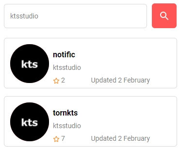
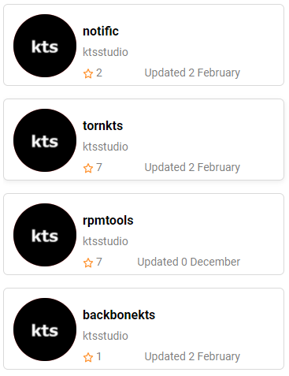
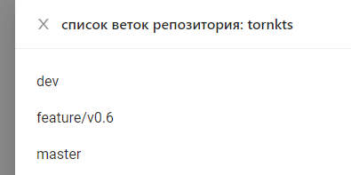

Поиск  gitHub репозиториев 
=====================================================================================
### [Ссылка на демо](https://viacheslavdyachenko.github.io/front-react-rep/ "Кликните для просмотра демо проекта") ###

Описание проекта
=====================================================================================

Проект представляет из себя React компонент по поиску открытых гит репозиториев компаний. Просто введите название интересующей вас компании в поисковую строку и нажмите кнопку поиска:

После чего вы увидите список открытых gitHub репозиториев с детальной информацией о них:

После получения списка репозиториев вы можете нажать на плитку репозитория и получить список веток:

Количество запросов к gitHub api ограничено самой политикой открытого api gitHub и на момент релиз проекта ровна 500 запросам в час.
В проекте реализован механизм пагинации, который помогает людям с плохим интернет соединением быстрее ознакомиться с результатом своего запроса.

Технологии используемые на проекте
=====================================================================================
* React
* JavaScript/TypeScript
* MobX
* Sass/Scss
* Webpack
* Babel
* HTML, CSS

Чему научился
=====================================================================================
Это мой первый учебный проект на React/TypeScript/MobX, поэтому я хорошо ознакомился со стеком данных технологий, разобрался в типизации typescript, понял что такое и для чего нужны менеджеры состояний, разобрался в react, в его основных инструментах, особенностях и подводных камнях, выучил react хуки и научился ими пользоваться, а так же разобрался в жизненном цикле реакт компонента и как его можно оптимизировать. 
Познакомился с роутингом с помощью библиотеки react-router-dom, получил опыт работы с библиотеками готовых реакт компонентов, такими как Ant Design, научился использовать на проекте css modules и понял в чём его преимущество, собрал свою первую самостоятельную dev и prod сборку с помощью webpack и babel.

Установка проекта
=====================================================================================
    yarn add
    yarn dev

